## Этап 1. Исследовательский анализ (EDA)

### Анализ качества данных 

На данном этапе был реализован код для проверки качества сэмплов, таким образом
в тестовой выборке не было найдено неполноценной разметки, также как и в валидационной.
В тренировочной выборке было обнаружено 12 снимков с неточной сегментацией. Ниже приведены все проблемные сэмплы. 
ОНИ БЫЛИ УДАЛЕНЫ ИЗ ОБУЧАЮЩЕЙ ВЫБОРКИ. Реализация кода находится в корневой папке в файле demo_train_dataset_for_students.py.

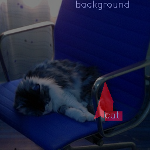
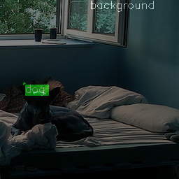
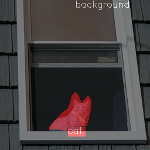
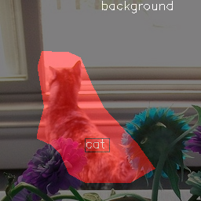
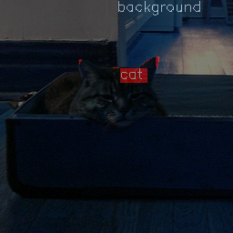
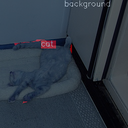
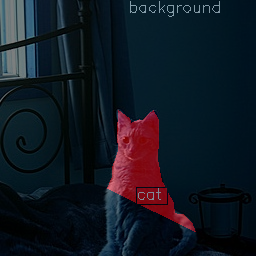
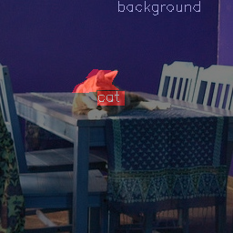
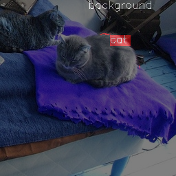
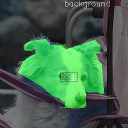
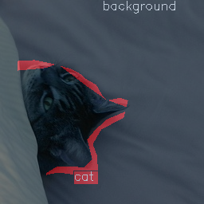
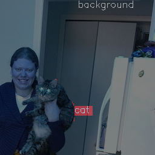


### EDA

Все работы по EDA проводились в Jupyter Notebook, тетрадка распаложена в
"\mmsegmentation\practicum_work\src\data\eda.ipynb". Там же расположены изображения, графики и тд.
По EDA для каждой из выборок: Val, Train, Test.

Для каждой из выборок было реализовано:
1) Загрузка данных
2) Описание базовой информации о датасете
3) Анализ размеров изображений
4) Анализ баланса классов
5) Визуализация примеров из датасета
6) Выводы

Таким образом, по ТЕСТОВОЙ выборке были получены следующие выводы:

 Размеры изображений:
   - Все изображения имеют размер 256x256

 Баланс классов:
   - background: 90.63% пикселей
   - cat: 3.38% пикселей
   - dog: 5.99% пикселей

 Сильный дисбаланс в пользу фонового класса

Таким образом, по ТРЕНИРОВОЧНОЙ выборке были получены следующие выводы:

 Размеры изображений:
   - Все изображения имеют размер 256x256

 Баланс классов:
   - background: 90.60% пикселей
   - cat: 4.98% пикселей
   - dog: 4.41% пикселей

 Сильный дисбаланс в пользу фонового класса

Таким образом, по ВАЛИДАЦИОННОЙ выборке были получены следующие выводы:

 Размеры изображений:
   - Все изображения имеют размер 256x256

 Баланс классов:
   - background: 88.54% пикселей
   - cat: 6.96% пикселей
   - dog: 4.50% пикселей

 Сильный дисбаланс в пользу фонового класса
 

## Этап 2. Формирование первичных гипотез

### Стартовая гипотеза 1: PSPNet с ResNet-50 backbone

**Описание гипотезы**  

На основе результатов EDA (сильный дисбаланс классов: фон ~90%, cat ~4-5%, dog ~4-6%)
была выбрана следующая стратегия:
1) Архитектура: PSPNet с ResNet-50 backbone

- PSPNet хорошо зарекомендовала себя для задач сегментации благодаря модулю Pyramid Pooling,
который позволяет учитывать контекст разных масштабов
- ResNet-50 обеспечивает хороший баланс между качеством и скоростью обучения
- Использование предобученных весов на ImageNet для ускорения сходимости

2) Функция потерь: Комбинация CrossEntropyLoss и DiceLoss

- CrossEntropyLoss (weight=1.0) - базовый loss для многоклассовой сегментации
- DiceLoss (weight=1.0) - добавлен для борьбы с дисбалансом классов, 
так как он фокусируется на пересечении предсказанных и истинных масок
- Такая комбинация позволяет лучше сегментировать мало представленные классы (cat и dog)

3) Аугментации:

- RandomFlip (prob=0.5) - горизонтальные отражения для увеличения вариативности
- PhotoMetricDistortion - изменение яркости/контраста для робастности к освещению
- Базовый набор аугментаций для стартового эксперимента, чтобы оценить "сырое" качество модели

4) Гиперпараметры:

- Batch size: 8 (оптимально для GPU с 12GB памяти)
- Learning rate: 0.001 (AdamW optimizer)
- Weight decay: 0.01 для регуляризации
- Epochs: 200 с валидацией каждые 5 эпох
- Input size: 256x256 (как в исходном датасете)
- Полиномиальное затухание LR: PolyLR с power=0.9

**Результаты обучения**  

ссылка на конфиг  конфиг: \practicum_work\src\work_dirs\pspnet_baseline\pspnet_r50_256x256_baseline.py

ссылка на clearml: https://app.clear.ml/projects/078603f73f5f477aaaae5a707dea12f7/experiments/7be7710a08f24ba5acd6341b4a1d50ff/output/execution

и еще одна ссылка с логами: ClearML results page: https://app.clear.ml/projects/078603f73f5f477aaaae5a707dea12f7/experiments/7be7710a08f24ba5acd6341b4a1d50ff/output/log

**Анализ качества**  

Лучшие метрики за все обучение:
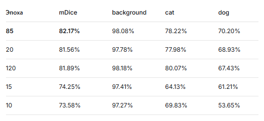

Динамика обучения:

mDice по эпохам:
5 эпох: 69.82% 🠒 10 эпох: 73.58% 🠒 15 эпох: 74.25% 🠒 20 эпох: 81.56% 🠒 85 эпох: 82.17% (лучший)

Средний mDice по тестовой выборке: 78.31%

 Метрики по классам:
  background: 98.41%
  cat: 69.37%
  dog: 67.16%
 
Примеры фейлов:

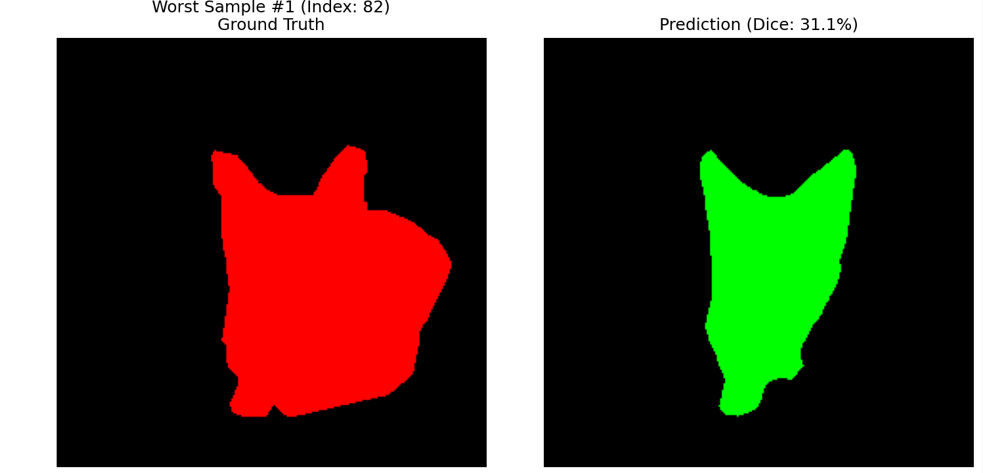
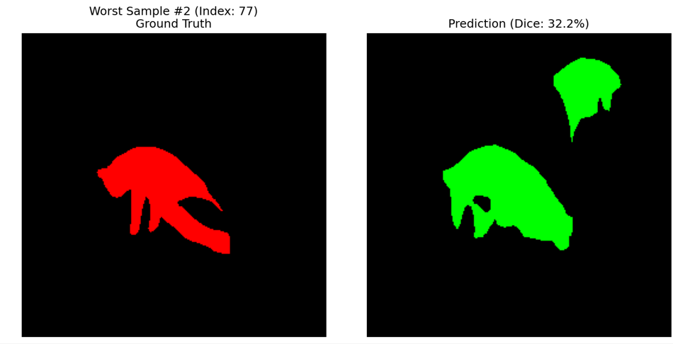
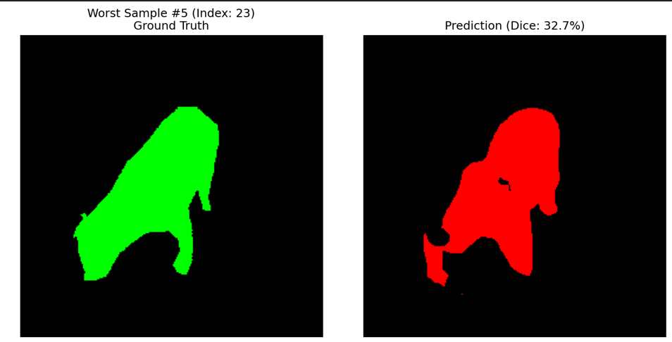

Примеры лучших правильных ответов модели:

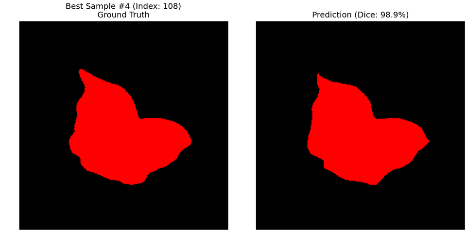
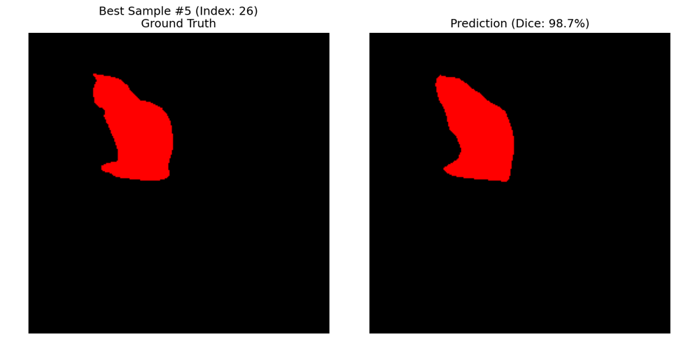
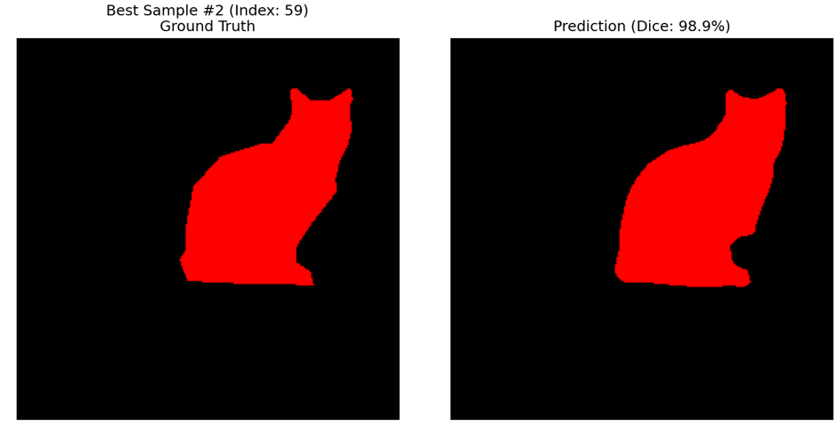


## Этап 3. Эксперименты по улучшению качества

### Эксперимент 1 

**Описание эксперимента**

Анализ базовой модели выявил две ключевые проблемы: недостаточная робастность из-за
минимальных аугментаций и дисбаланс классов (cat/dog сильно уступают фону). 
Для их решения в эксперименте 1 были усилены аугментации и увеличен вес DiceLoss.
В базовую модель добавлены вертикальные отражения (RandomFlip vertical), повороты 
(RandomRotate до ±30°), расширен диапазон фотометрических искажений (brightness_delta=32,
contrast_range=0.5-1.5) и внедрен RandomCutOut для регуляризации. Вес DiceLoss увеличен с
1.0 до 1.5 для основного head и до 0.6 для auxiliary head.

**Результаты обучения**

ссылка на конфиг: \practicum_work\src\work_dirs\pspnet_exp1\pspnet_r50_256x256_exp1_aug_weights.py

ссылка на clearml: https://app.clear.ml/projects/078603f73f5f477aaaae5a707dea12f7/experiments/6236f08a77f34843b3e6985748a462b2/output/execution

**Анализ качества**

На тестовой выборке модель достигла mDice 84.09%,
что на 1.92% выше базовой (82.17%). 
Наибольший прирост показал класс dog (+4.41%, с 70.20% до 74.61%),
класс cat улучшился незначительно (+0.84%, до 79.06%), фон вырос до 98.61%.
В лучших предсказаниях модель достигает почти идеальной сегментации: 
5 примеров с mDice >98.5%, где dog сегментируется с точностью 100%, cat >97%. 
В худших случаях (индексы 55, 23, 115, 46, 49) модель полностью пропускает животных 
(Dice=0%), хотя фон сегментирует отлично (>95%). 
Это указывает на проблему с мелкими или сильно замаскированными объектами.

Лучшие предсказания:

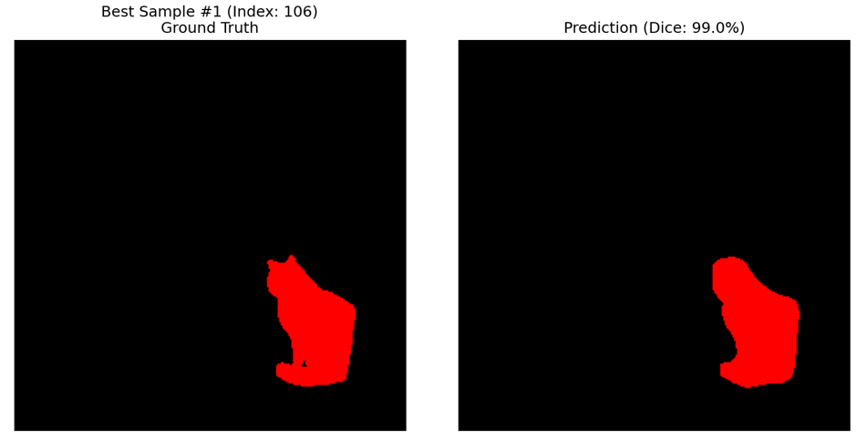
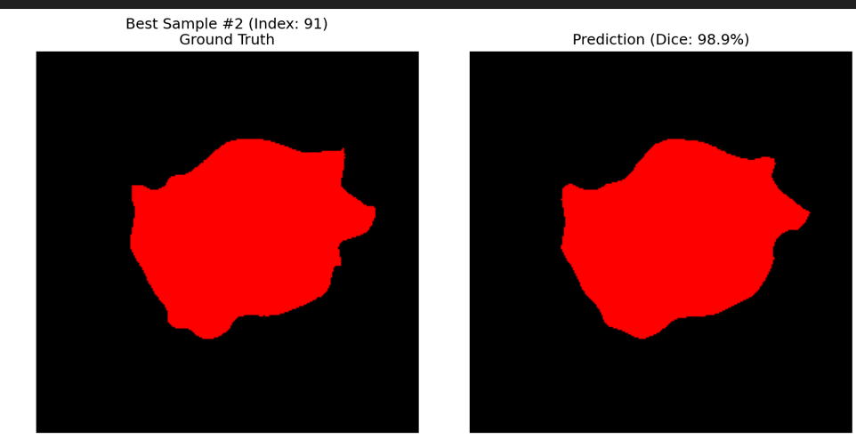

Худшие предсказания:

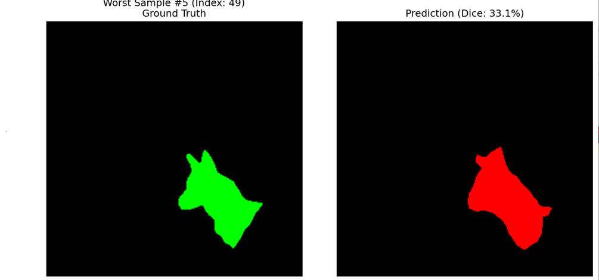
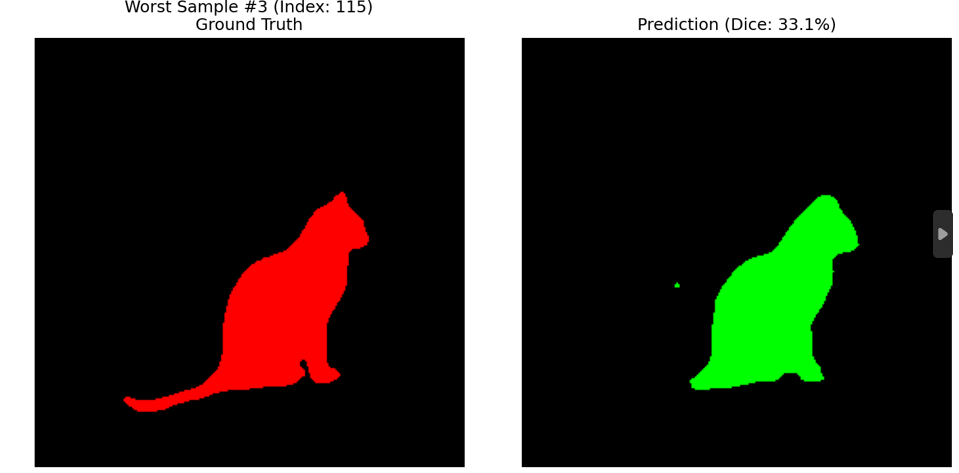

### Эксперимент 2

**Описание эксперимента**

Для улучшения сегментации объектов разного масштаба
базовая архитектура PSPNet заменена на DeepLabV3+ с ASPP модулем. 
Основные изменения: dilated convolutions в последних слоях backbone, 
ASPP с dilation rates (1,6,12,18) для мультимасштабного контекста, 
скип-соединения для восстановления деталей. Из эксперимента 1 сохранены 
усиленные аугментации и вес DiceLoss=1.5,
batch size уменьшен до 6, learning rate до 0.0005.

**Результаты обучения**

ссылка на конфиг: \practicum_work\src\work_dirs\deeplabv3plus_exp2\deeplabv3plus_r50_256x256_exp2.py

ссылка на clearml: https://app.clear.ml/projects/078603f73f5f477aaaae5a707dea12f7/experiments/6fea214a36e54eb485084b7e7df3b6c6/output/execution

**Анализ качества**

DeepLabV3+ показала mDice 85.06% на тестовой выборке, 
что на 0.97% выше эксперимента 1 и на 2.89% выше базовой модели.
Все классы улучшились: background до 98.79% (+0.18%), cat до 79.98% (+0.92%), dog до 76.40% (+1.79%). 
Разрыв между cat и dog сократился до 3.58% против 4.45% в эксперименте 1
Лучшие предсказания достигли 99.38% mDice (индекс 113),
что выше максимума эксперимента 1 (99.01%). В худших случаях
(индексы 11, 23, 46) модель по-прежнему пропускает животных, но появились 
примеры с частичной сегментацией: индекс 77 (cat=4.89%), индекс 73 (dog=10.83%). 
DeepLabV3+ лучше справляется с границами объектов благодаря ASPP модулю.

Лучшие предсказания:

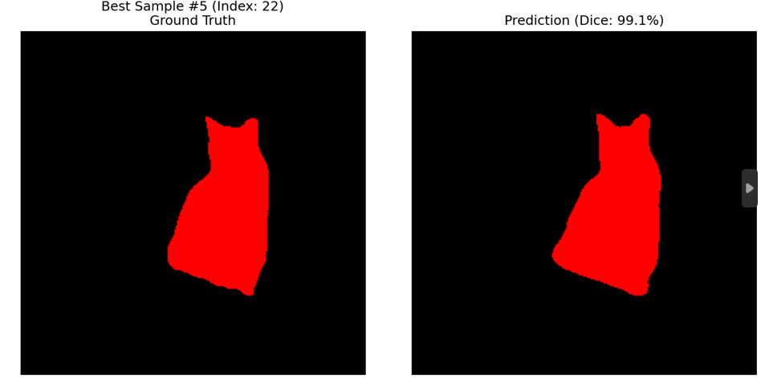
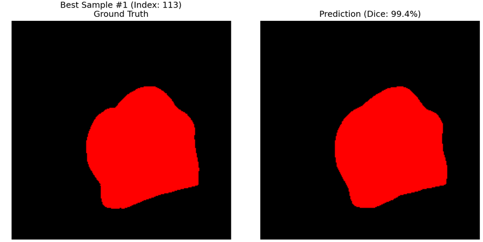

Худшие предсказания:

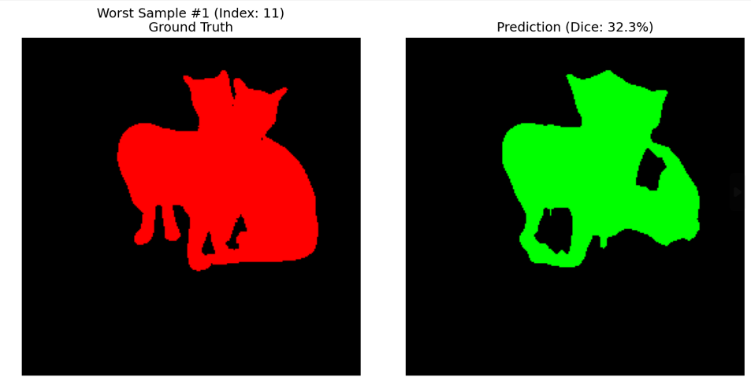
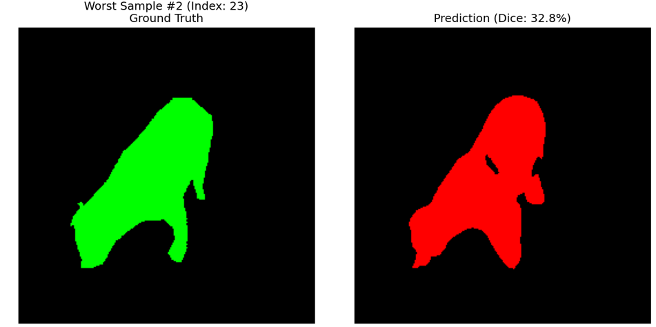

## Этап 4. Заключение и выбор лучшего эксперимента

### Лучший эксперимент 

Лучшим признан Эксперимент 2 на архитектуре DeepLabV3+ с усиленными аугментациями. 
Выбор обусловлен следующими факторами:
В эксперименте использована архитектура DeepLabV3+ с ASPP модулем, 
обеспечивающим мультимасштабный контекст, и декодером для восстановления деталей. 
От эксперимента 1 унаследованы усиленные аугментации (RandomRotate, 
RandomCutOut, PhotoMetricDistortion с расширенным диапазоном) и увеличенный 
вес DiceLoss (1.5). Гиперпараметры оптимизированы: batch size уменьшен до 6, 
learning rate снижен до 0.0005 для стабильности обучения.

**mDice (test subset) = 85.06%**


### Примеры корректных предсказаний (тестовый датасет)

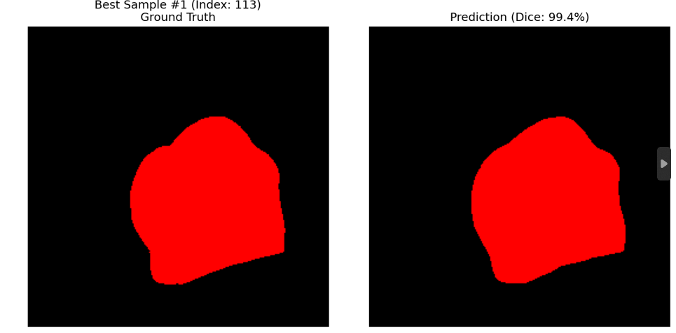
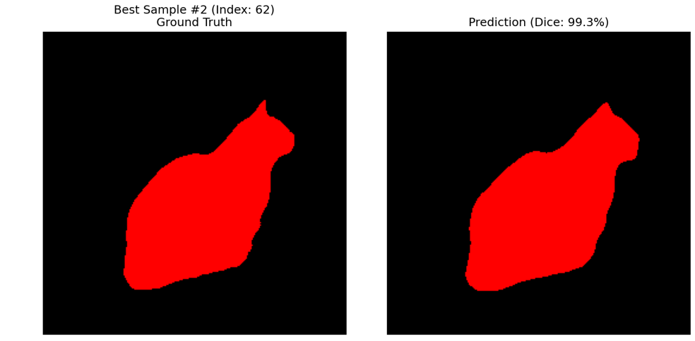
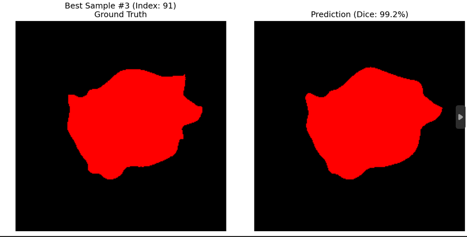
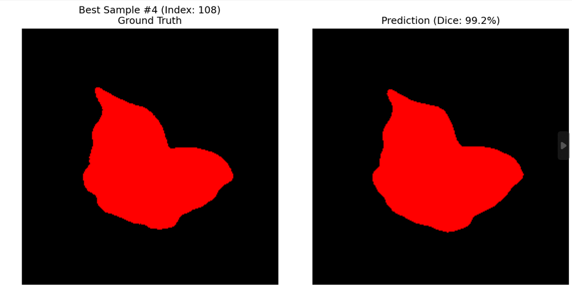
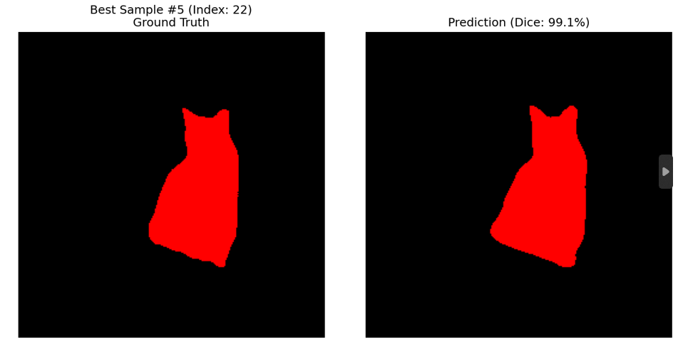

### Примеры ошибок (тестовый датасет)

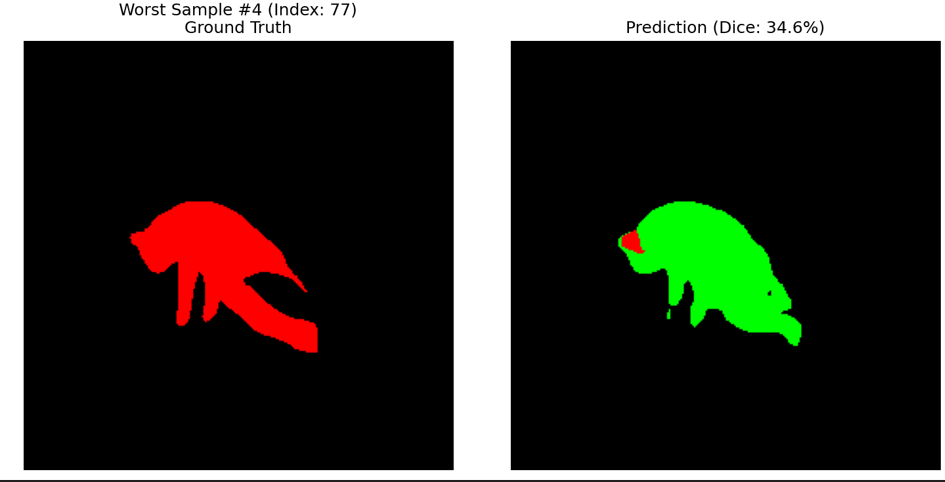
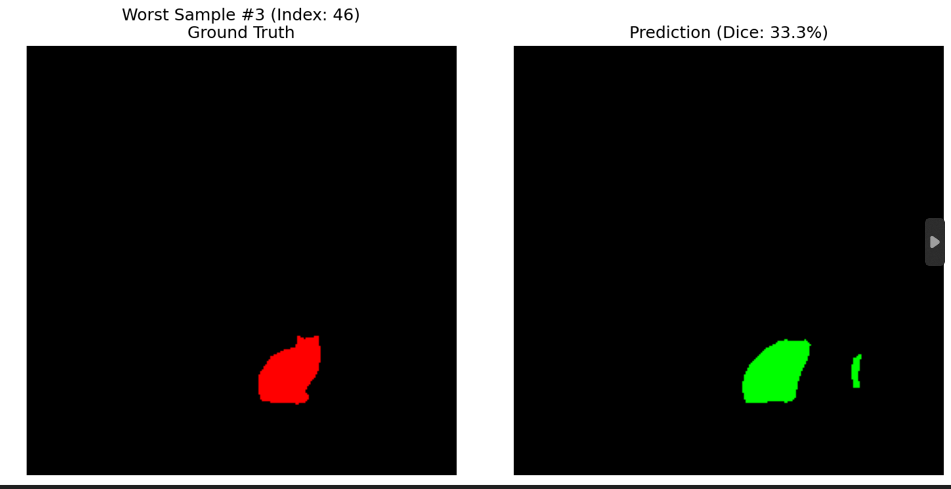
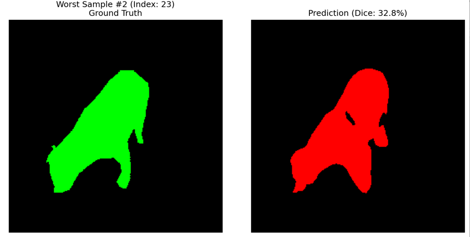

### Возможности для улучшения 

Анализ ошибок лучшей модели выявил несколько направлений для дальнейшего повышения качества:

Проблема 1: Пропуск мелких объектов. В худших случаях (индексы 11, 23, 46) модель полностью игнорирует животных, хотя фон сегментирует идеально. Это указывает на то, что мелкие объекты теряются на фоне. Решением может стать применение тестовых аугментаций (TTA) с мультимасштабным анализом или использование архитектур с механизмами внимания (SegFormer, Mask2Former), которые лучше выделяют мелкие объекты.

Проблема 2: Частичная сегментация. В индексах 77 и 73 модель распознает лишь фрагменты животных (cat=4.89%, dog=10.83%). Вероятно, это связано со сложными ракурсами или частичным перекрытием. Улучшить ситуацию помогут более агрессивные аугментации при обучении, имитирующие частичное затенение и необычные ракурсы.

Проблема 3: Дисбаланс между cat и dog. Несмотря на прогресс, класс dog (76.40%) все еще отстает от cat (79.98%). Целесообразно ввести взвешенную функцию потерь с увеличенным весом для класса dog или применить методы увеличения выборки (oversampling) для изображений с собаками.

Дополнительные рекомендации: Использование ансамбля моделей (PSPNet + DeepLabV3+) может сгладить ошибки каждой архитектуры. Также перспективно применение предобученных энкодеров на более крупных датасетах или дообучение на сложных примерах (hard example mining).

## Этап 5. Документация кода

```
practicum_work
├── src
│   ├── data
│   │   ├── eda.py - реализация этапа 1 - EDA анализ оформленный в тетрадке
│   ├── analysis 
│   │   ├── analyze_test_predictions.py - детальный анализ качества обученной модели сегментации на тестовой выборке:
│   │   │   - Загружает обученную модель и прогоняет её на всех тестовых изображениях
│   │   │   - Вычисляет метрику Dice coefficient для каждого класса (фон, кошки, собаки)
│   │   │   - Сортирует результаты по качеству и сохраняет:
│   │   │   - Статистику по всей выборке (средние метрики)
│   │   │   - CSV-файл с метриками для каждого изображения
│   │   │   - Визуализации 5 лучших и 5 худших предсказаний (маска + предсказание)
│   │   │   - Текстовый отчет с подробной статистикой
│   ├──  work_dirs
│   │   ├──  deeplabv3plus_exp2
│   │   │   ├── 20260221_235751.log - логи ко 2 эксперименту в формате txt
│   │   │   ├── deeplabv3plus_r50_256x256_exp2.py - config 2 эксперимента
│   │   ├──  pspnet_baseline
│   │   │   ├── 20260221_212847.log - логи к бэйзлайн гипотезе в формате txt
│   │   │   ├── deeplabv3plus_r50_256x256_exp2.py - config бэйзлайн гипотезы
│   │   ├──  pspnet_exp1
│   │   │   ├── 20260221_224710.log - логи к 1 эксперименту в формате txt
│   │   │   ├── pspnet_r50_256x256_exp1_aug_weights.py - config 1 эксперимента
├── supplementary
│   ├── viz
│   │   ├──  problem_sample - тут храянятся проблемные сэмплы которые были обнаружены на 1 этапе и удалены
│   │   ├──  test_analysis_results_exp1 - тут хранится для 1 эксперимента csv таблица с метриками на тестовой выборке, 
│   │   │                               - ОТЧЕТ ПО ТЕСТИРОВАНИЮ МОДЕЛИ в формтае txt (количество спрогнозированных сэмплов, Общие метрики, Метрики по классам, ТОП-5 ХУДШИХ и ЛУЧШИХ ПРЕДСКАЗАНИЙ)
│   │   │                               - ВИЗУАЛИЗАЦИЯ лучших и худших предсказаний
│   │   ├──  test_analysis_results_exp2 - тут хранится для 2 эксперимента csv таблица с метриками на тестовой выборке, 
│   │   │                               - ОТЧЕТ ПО ТЕСТИРОВАНИЮ МОДЕЛИ в формтае txt (количество спрогнозированных сэмплов, Общие метрики, Метрики по классам, ТОП-5 ХУДШИХ и ЛУЧШИХ ПРЕДСКАЗАНИЙ)
│   │   │                               - ВИЗУАЛИЗАЦИЯ лучших и худших предсказаний
│   │   ├──  test_analysis_results_v3_85epoch - тут хранится для бэйзлайн гипотезы csv таблица с метриками на тестовой выборке, 
│   │   │                               - ОТЧЕТ ПО ТЕСТИРОВАНИЮ МОДЕЛИ в формтае txt (количество спрогнозированных сэмплов, Общие метрики, Метрики по классам, ТОП-5 ХУДШИХ и ЛУЧШИХ ПРЕДСКАЗАНИЙ)
│   │   │                               - ВИЗУАЛИЗАЦИЯ лучших и худших предсказаний
```